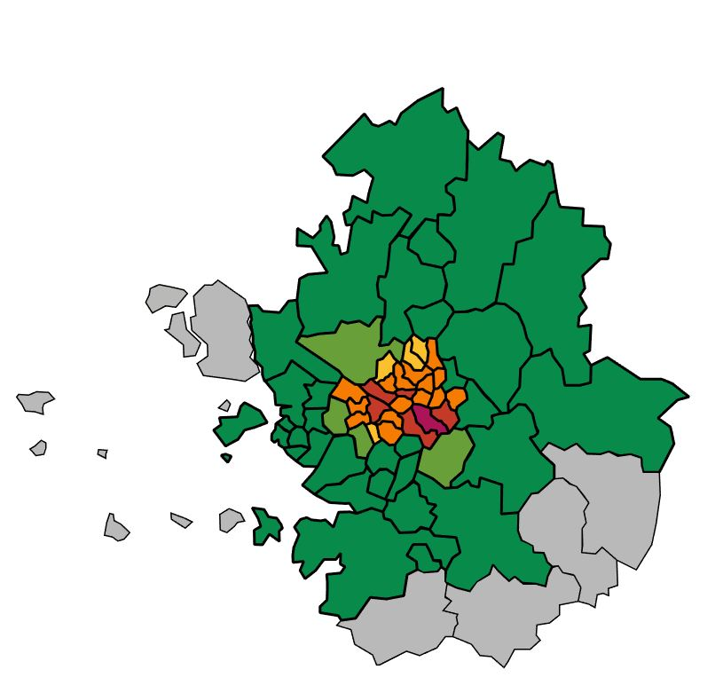
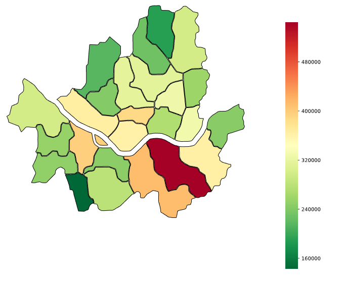

## seoulMap

#### 목표

- 지도 데이터(svg)을 택시 교통량에 따라 색을 입혀 히트맵 표현
- 구역별 택시 교통량에 따른 heatmap 구현

#### 구성

- [data](data) : svg파일, 시군구 번호 파일, 결과 데이터 파일 정리
  - [image](/data/image) : git markdown image folder
  - [origin_svg](/data/origin_svg) : 대한민국, 서울 svg 원본 파일
  - [taxi_data](/data/taxi_data) : 택시데이터 샘플 파일 *(scala로 전처리 된 데이터)*
  - [result](/data/result) : 예제 파일 결과 파일
  - [csv](/data/csv) : csv 파일 정리
- [examples](examples) : 예제 파일 정리
  - [mongoDB](/examples/mongoDB) : mongoDB 예제 파일
  - [seaborn](/examples/seaborn) : 택시 교통량에 따라 seaborn 지역별 색깔 추출 후 svg 파일에 히트맵으로 시각화 예제 파일
  - [visualization](/examples/visualization) : csv 파일을 read하여 svg 파일에 택시 교통량에 따라 히트맵으로 시각화

#### 데이터
- 서울 택시 데이터 : http://data.seoul.go.kr/dataList/datasetView.do?infId=OA-12066&srvType=F&serviceKind=1

- *택시 데이터는 scala를 통해 자료를 가공했습니다.*

#### 전체적인 과정
1. mongoDB에서 가져온 서울 택시 데이터 결과(json)를 read 한다.
2. read한 데이터를 토대로 dataframe을 생성하고 seaborn을 이용해 heatmap을 생성
3. 2번 결과에서 각 구별 색깔을 seoul map파일(svg)에 색깔을 입힌다.
4. 색깔 입힌 seoul map 결과와 heat map 결과물을 합친다.
5. 합친 결과물 svg파일로 저장

#### 결과 이미지 예시

- 서울 및 경기지역 택시 교통량 시각화

- 택시 교통량 데이터를 seaborn 시각화 후 svg파일에 지역별 색깔 입히기

#### 